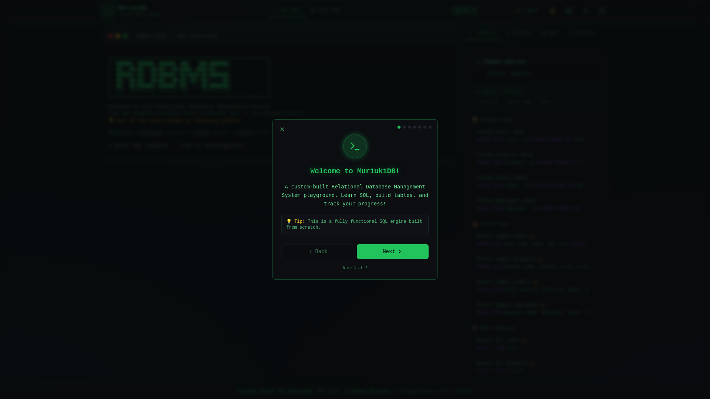

# MuriukiDB - Custom RDBMS

A custom Relational Database Management System built for the **Pesapal Junior Dev Challenge '26**.

**Live Demo**: [https://rdbms.lovable.app](https://rdbms.lovable.app)



## ✨ Features

- **Complete SQL Parser** - CREATE, INSERT, SELECT, UPDATE, DELETE with JOINs
- **B-Tree Indexing** - Optimized query performance
- **Terminal-Style REPL** - Real-time SQL execution with syntax highlighting
- **Demo App** - Visual CRUD interface for 5 table types
- **Gamification** - 23 military ranks, XP rewards, badges & global leaderboard
- **Real-time Updates** - Live data synchronization

## 🎮 Ranking System

Progress from **Private (0 XP)** to **Commander in Chief (1,000,000 XP)**!


## 🚀 Quick Start

```bash
git clone https://github.com/Samuel-Muriuki/MuriukiDB-RDBMS.git
cd MuriukiDB-RDBMS
npm install
npm run dev
```

## 🔧 Environment Setup

1. Copy `.env.example` to `.env`
2. Configure your Supabase credentials:
   - `VITE_SUPABASE_URL`
   - `VITE_SUPABASE_PUBLISHABLE_KEY`
   - `VITE_SUPABASE_PROJECT_ID`

## 🚢 Deploying to Vercel

1. Push your code to GitHub
2. Import the repository in [Vercel](https://vercel.com)
3. Set framework preset: **Vite**
4. Build command: `npm run build`
5. Output directory: `dist`
6. Add environment variables in Project Settings

The included `vercel.json` handles SPA routing automatically.

## 📚 Documentation

See [DOCUMENTATION.md](DOCUMENTATION.md) for detailed architecture, SQL commands, and security features.

## 🛠️ Tech Stack

- **Frontend**: React 18 + TypeScript + Vite
- **Styling**: Tailwind CSS with terminal theme
- **Backend**: Supabase (Edge Functions, RLS, Real-time)
- **Deployment**: Vercel / Lovable

## 👨‍💻 Author

**Samuel Muriuki**
- Portfolio: [samuel-muriuki.vercel.app](https://samuel-muriuki.vercel.app/)
- GitHub: [github.com/Samuel-Muriuki](https://github.com/Samuel-Muriuki)

---

Built with [Lovable](https://lovable.dev) AI.
