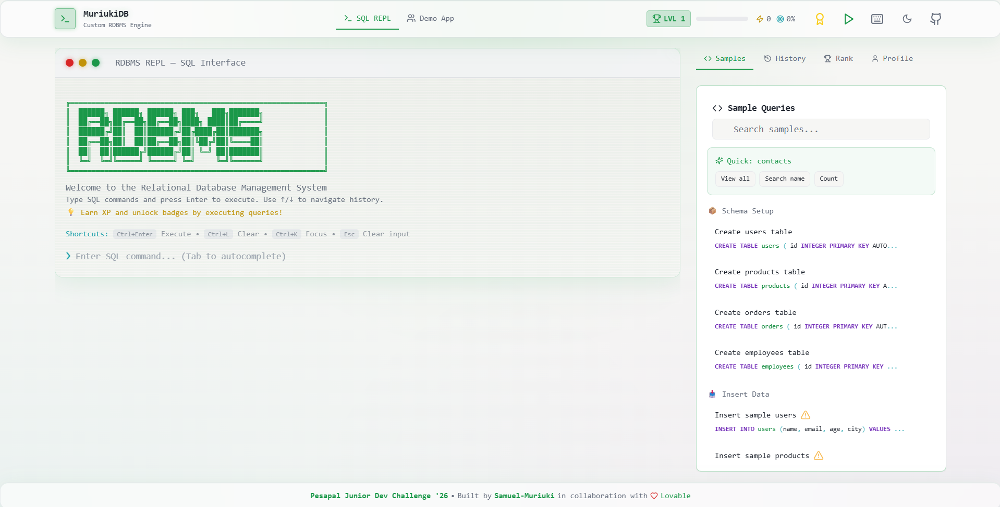
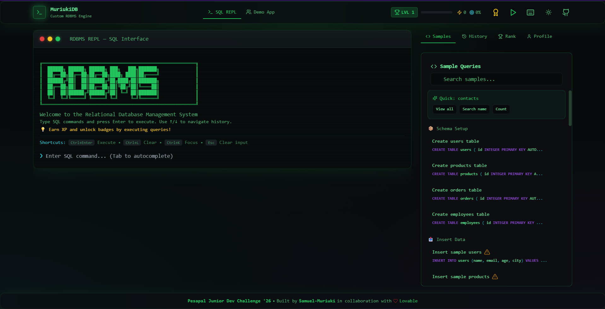
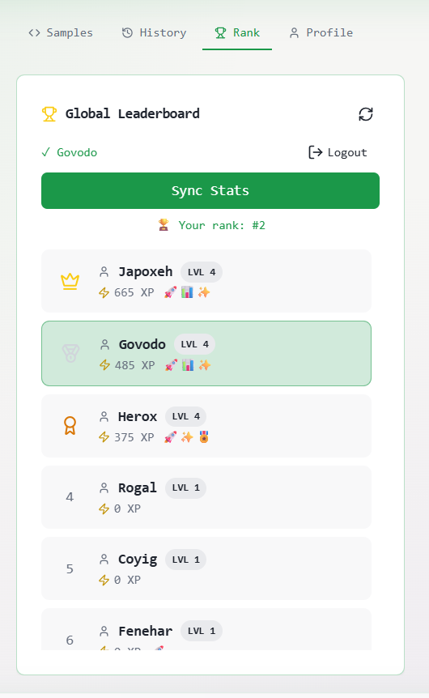

# MuriukiDB - Custom RDBMS

A custom Relational Database Management System built for the **Pesapal Junior Dev Challenge '26**.

**Live Demo**: [https://rdbms-muriuki.vercel.app/](https://rdbms-muriuki.vercel.app/)

## Screenshots

### SQL REPL Interface (Light Theme)


### SQL REPL Interface (Dark Theme)


### Achievements & Ranking System


### Global Leaderboard


## Video Demonstration


## ✨ Features

- **Complete SQL Parser** - CREATE, INSERT, SELECT, UPDATE, DELETE with JOINs
- **B-Tree Indexing** - Optimized query performance
- **Terminal-Style REPL** - Real-time SQL execution with syntax highlighting
- **Demo App** - Visual CRUD interface for 5 table types (Contacts, Users, Products, Orders, Employees)
- **Gamification** - 23 military ranks, XP rewards, badges & global leaderboard
- **Real-time Updates** - Live data synchronization
- **Sound Effects** - Audio feedback for XP gains, achievements, and rank ups (Web Audio API)
- **Interactive Tour** - Guided walkthrough with spotlight overlay
- **PWA Support** - Install as a native app on mobile devices

## 🎮 Ranking System

Progress from **Private (0 XP)** to **Commander in Chief (1,000,000 XP)**!

## 🚀 Quick Start

```bash
git clone https://github.com/Samuel-Muriuki/MuriukiDB-RDBMS.git
cd MuriukiDB-RDBMS
npm install
npm run dev
```

## 🔧 Environment Setup

1. Copy `.env.example` to `.env`
2. Configure your Supabase credentials:
   - `VITE_SUPABASE_URL` - Your Supabase project URL
   - `VITE_SUPABASE_PUBLISHABLE_KEY` - Your Supabase anon/public key
   - `VITE_SUPABASE_PROJECT_ID` - Your Supabase project ID

## 🚢 Deploying to Vercel

1. Push your code to GitHub
2. Import the repository in [Vercel](https://vercel.com)
3. Set framework preset: **Vite**
4. Build command: `npm run build`
5. Output directory: `dist`
6. Add environment variables in Project Settings

The included `vercel.json` handles SPA routing automatically.

## 📚 Documentation

See [DOCUMENTATION.md](DOCUMENTATION.md) for detailed architecture, SQL commands, and security features.

## 🛠️ Tech Stack

- **Frontend**: React 18 + TypeScript + Vite
- **Styling**: Tailwind CSS with terminal theme
- **Backend**: Supabase (Edge Functions, RLS, Real-time)
- **Audio**: Web Audio API for synthesized sound effects
- **Deployment**: Vercel

## 🔧 Custom vs Supabase Components

### Fully Custom (Written from Scratch)

| Component | File | Description |
|-----------|------|-------------|
| SQL Lexer | `src/lib/rdbms/lexer.ts` | Tokenizes SQL with XSS protection |
| SQL Parser | `src/lib/rdbms/parser.ts` | Builds AST from tokens |
| Query Executor | `src/lib/rdbms/executor.ts` | Executes queries with validation |
| B-Tree Index | `src/lib/rdbms/btree.ts` | In-memory index structure |
| REPL Interface | `src/components/REPL.tsx` | Terminal-style SQL interface |
| Statement Splitter | `src/lib/rdbms/utils.ts` | Multi-statement SQL parsing |

### Backed by Supabase

| Feature | Purpose |
|---------|---------|
| Data Persistence | Tables stored in `rdbms_tables`, rows in `rdbms_rows` |
| Authentication | Supabase Auth with email/password |
| Row-Level Security | RLS policies isolate user data |
| Real-time Sync | Live updates via Supabase Realtime |
| Rate Limiting | Edge Functions enforce query limits |
| Cleanup | Edge Function removes stale anonymous data |

## ⚠️ Known Limitations

See [KNOWN_LIMITATIONS.md](KNOWN_LIMITATIONS.md) for a complete list including:

- **Indexing**: In-memory B-Tree only (not persisted across sessions)
- **Transactions**: No ACID support (no BEGIN/COMMIT/ROLLBACK)
- **Concurrency**: No locking (last write wins)
- **Subqueries**: Nested SELECT not supported
- **Data Types**: INTEGER, TEXT, REAL, BOOLEAN, DATE only

## 👨‍💻 Author

**Samuel Muriuki**
- Portfolio: [samuel-muriuki.vercel.app](https://samuel-muriuki.vercel.app/)
- GitHub: [github.com/Samuel-Muriuki](https://github.com/Samuel-Muriuki)

## ☕ Support

If you find this project helpful, consider supporting me!

[](https://www.buymeacoffee.com/elsamm)

---

Built with [Lovable](https://lovable.dev/invite/A5KC0U8) AI.
